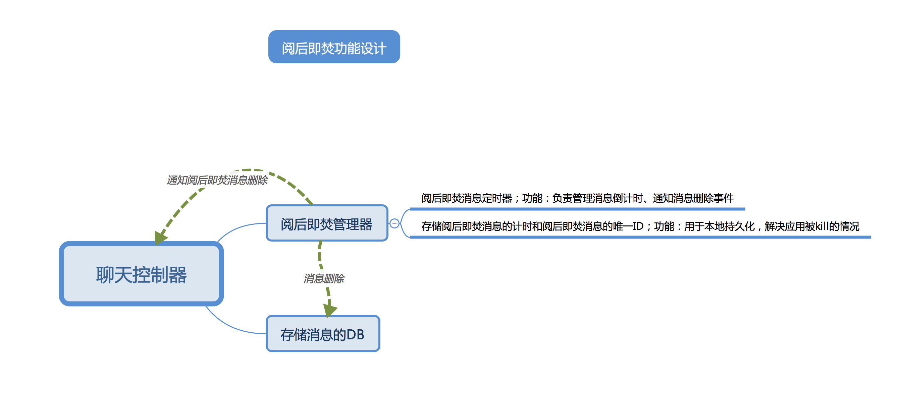
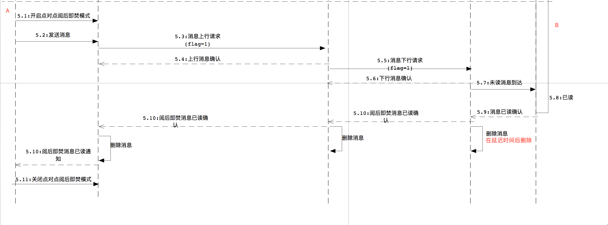

## 阅后即焚
``` 
  基本实现流程差不多是：
  1、用户A发送消息到B用户。
  2、B用户收到消息以后，消息在阅读时，进行倒计时操作，同时发送阅后即焚消息的已读消息给A。 
  3、A收到已读回执以后，立刻删除自身的消息。
  4、B用户在倒计时结束的时候再删除 消息。 
```
- 类文件解释
```
LYTSDKDataBase+LYTDelayDelete.h
负责加入阅后即焚消息后的本地存储功能。
LYTDelayDeleteTools.h
负责管理阅后即焚消息的计时器、删除的事件通知
```
- 加入阅后即焚的消息到阅后即焚消息管理器
```
/**
加入 阅后即焚的消息 到计时器
@param message 阅后即焚消息对象
*/
- (void)addDelayMessage:(LYTMessage*)message succeed:(void (^)(BOOL))block;
```
- 查询阅后即焚消息,最新的计时时间
```
/**
根据查询当前 阅后即焚消息,最新的计时时间
@param message 阅后即焚消息对象
*/
- (NSInteger)quaryDelayTimeForMessage:(LYTMessage *)message;
```
- 阅后即焚消息刷新时间的监听
```
/**
阅后即焚消息刷新时间的监听
@param targetID 会话Id
@param messageId 消息唯一标示
@param time 当前需要显示的阅后即焚的时间
*/
- (void)chatTableDeleyMessageRefreshStatuWithTargetId:(NSString *)targetID
messageId:(NSString *)messageId
showTime:(NSString *)time;
```
- 阅后即焚消息倒计时结束
```
/**
阅后即焚消息即将销毁掉的监听 (DelayDeleteDelegate需要负责UI上cell的删除 ，本工具负责本地数据库的更新操作)
@param message 阅后即焚消息对象
*/
- (void)chatTableWillDeleteMessage:(LYTMessage *)message;

```
- 阅后即焚设计

- 阅后即焚消息基本交互模式


